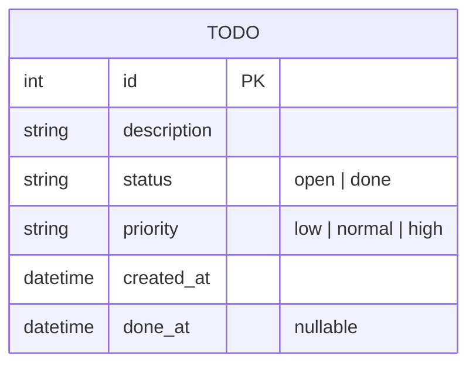
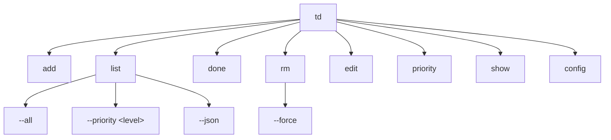
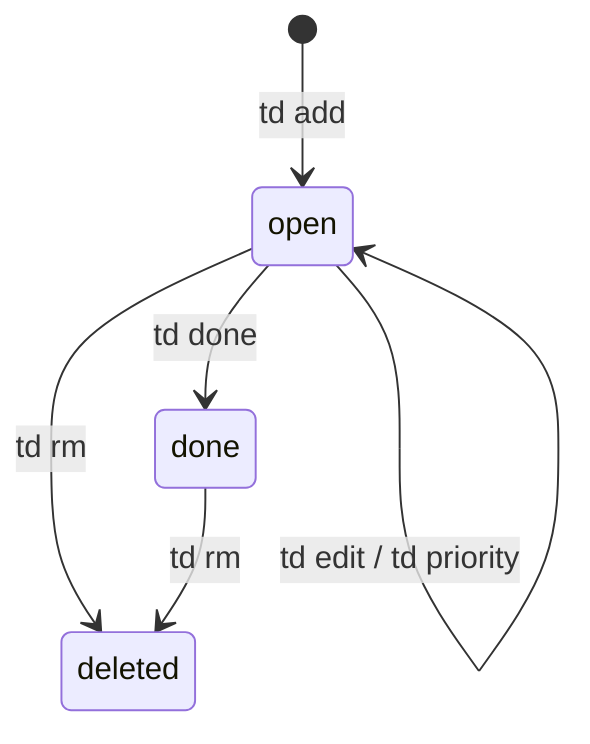
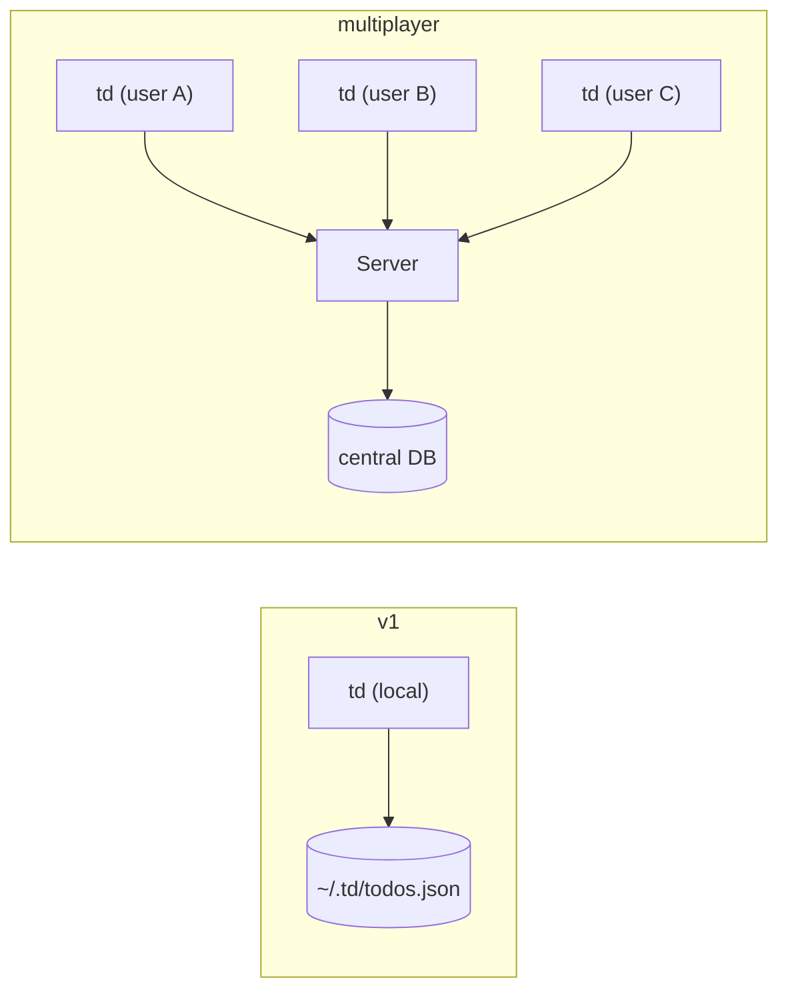

# Spec: `todo` — A CLI Todo Tool

> **Status**: DRAFT  
> **Version**: 0.1.0  
> **Author**: Simon  
> **Last amended**: 2026-04-30  
> **SDLC Profile**: `contemporary-best-practice@1.0.0`

---

## Intent

A fast, keyboard-native CLI tool for managing personal todo items. The tool must feel like a natural extension of a terminal workflow — zero configuration to start, human-readable storage, and composable with standard Unix tools.

The v1 scope is strictly single-user, local. The architecture must not preclude a future multiplayer extension (see [Future: Multiplayer](#future-multiplayer-cli-todo-with-central-server)), but must not be designed around it.

---

## Constraints

- **Language**: Node.js (TypeScript) or Python — to be decided at implementation time per SDLC profile
- **Storage**: Plain files only in v1 (no database). Human-readable format (Markdown or JSON)
- **Distribution**: Single binary or globally installable package (`npm i -g td` or `pip install td-cli`)
- **No runtime daemon** in v1
- **No network calls** in v1
- **Config file** optional; sensible defaults must work with zero config
- **Test coverage floor**: 80% (per SDLC profile)

---

## Functional Requirements

### FR-1: Add a todo item
- Command: `td add "Buy milk"`
- Creates a new todo with a unique ID, default priority `normal`, status `open`
- Outputs: `Created #4 — Buy milk`

### FR-2: List todo items
- Command: `td list` (alias: `td ls`)
- Displays all open todos in a table: ID, priority, age, description
- Flag `--all` includes completed todos
- Flag `--priority high` filters by priority
- Output is paginated if > 20 items; respects `$PAGER`

### FR-3: Complete a todo
- Command: `td done <id>`
- Marks item as complete, records completion timestamp
- Outputs: `Done — #4 Buy milk`

### FR-4: Delete a todo
- Command: `td rm <id>`
- Requires confirmation prompt unless `--force` flag is passed
- Hard-deletes (no soft delete in v1)

### FR-5: Edit a todo
- Command: `td edit <id> "New description"`
- Updates description only in v1
- Outputs: `Updated #4 — New description`

### FR-6: Prioritise a todo
- Command: `td priority <id> <low|normal|high>`
- Updates priority field
- Outputs: `Priority set — #4 [high] Buy milk`

### FR-7: View a single todo
- Command: `td show <id>`
- Displays full detail: ID, status, priority, created, completed, description

### FR-8: Storage location
- Default: `~/.td/todos.json` (or `.md` — TBD at implementation)
- Override via env var `TD_DATA_DIR` or config file `~/.td/config`

### FR-9: Human-readable storage
- Storage file must be readable and manually editable without data loss
- JSON preferred for v1 (structured, widely toolable); Markdown table as a future option

### FR-10: Exit codes
- `0` on success
- `1` on user error (bad args, item not found)
- `2` on system error (unwritable file, corrupt data)

---

## Non-Functional Requirements

### NFR-1: Performance
- All commands complete in < 100ms on a list of 10,000 items

### NFR-2: Usability
- Zero configuration required to use
- `td --help` and `td <command> --help` always available
- Errors are human-readable with a suggested fix where possible

### NFR-3: Reliability
- No data loss on interrupted writes (atomic write pattern)
- Corrupt storage file produces a clear error, not a silent failure

### NFR-4: Composability
- `td list --json` outputs newline-delimited JSON for piping to `jq` etc.
- Exit codes (see FR-10) are consistent and documented

### NFR-5: Portability
- Works on macOS, Linux
- Windows: not in scope for v1 but must not be actively broken

---

## Open Questions

- [ ] **Storage format**: JSON vs Markdown table? JSON is more reliable for machine writes; Markdown is more human-editable. Leaning JSON for v1 with a `td export --markdown` command.
- [ ] **ID scheme**: Auto-incrementing integer (simple, familiar) vs. short hash (stable across sync in multiplayer future). Leaning integer for v1 with a note that IDs are local-only.
- [ ] **Config file format**: TOML vs YAML vs JSON? TOML is most human-friendly for config.
- [ ] **Language choice**: Python feels more portable for a CLI tool; TypeScript gives better structured type safety for the future server model. Defer to SDLC profile decision.

---

## Data Model

---

## Command Structure

---

## Lifecycle Flow (v1)

---

## Breakdown

> Generated by Breakdown Agent from spec above.  
> Each item links to the FR/NFR it satisfies.

### Epic 1: Core data layer
- [ ] **T-1.1** Define `Todo` data model and storage schema → FR-8, FR-9
- [ ] **T-1.2** Implement atomic read/write for storage file → NFR-3
- [ ] **T-1.3** Implement auto-incrementing ID generation → Open Q: ID scheme
- [ ] **T-1.4** Unit tests: data model validation, corrupt file handling → NFR-3

### Epic 2: CLI scaffold
- [ ] **T-2.1** Set up CLI entry point and command router → all FRs
- [ ] **T-2.2** Implement `--help` for root and all subcommands → NFR-2
- [ ] **T-2.3** Implement consistent exit codes → FR-10
- [ ] **T-2.4** Implement `--json` output flag on `list` → NFR-4

### Epic 3: Core commands
- [ ] **T-3.1** `td add` → FR-1
- [ ] **T-3.2** `td list` (with `--all`, `--priority`, pagination) → FR-2
- [ ] **T-3.3** `td done` → FR-3
- [ ] **T-3.4** `td rm` (with confirmation + `--force`) → FR-4
- [ ] **T-3.5** `td edit` → FR-5
- [ ] **T-3.6** `td priority` → FR-6
- [ ] **T-3.7** `td show` → FR-7

### Epic 4: Config
- [ ] **T-4.1** Config file parsing (`TD_DATA_DIR` env var + config file) → FR-8
- [ ] **T-4.2** `td config` command (get/set config values)
- [ ] **T-4.3** Sensible defaults with zero config → NFR-2

### Epic 5: Quality gate
- [ ] **T-5.1** Integration tests: full command round-trips → all FRs
- [ ] **T-5.2** Adversary Agent: edge cases (empty list, bad IDs, corrupt file, concurrent writes)
- [ ] **T-5.3** Coverage check ≥ 80% → NFR (SDLC profile)
- [ ] **T-5.4** Performance test: 10,000 item list < 100ms → NFR-1

---

## Future: Multiplayer CLI Todo with Central Server

> Out of scope for v1. Captured here to constrain v1 architecture decisions.

### Intent

Multiple users share todo lists. A central server owns the canonical state. Clients (`td`) sync over the network. Conflict resolution is last-write-wins in v1 multiplayer (CRDTs or OT deferred).

### Architectural delta from v1

### Additional requirements (future spec, not v1)

- **FR-M1**: `td sync` — push local state to server, pull remote state, merge
- **FR-M2**: `td share <list-name> <user>` — grant another user access to a named list
- **FR-M3**: Named lists — todos belong to a named list (default: `personal`)
- **FR-M4**: User identity — local keypair or server-issued token; no passwords in v1 multiplayer
- **FR-M5**: Offline-first — all commands work offline; sync on next `td sync` or background daemon (opt-in)
- **NFR-M1**: Server must be self-hostable (Docker image provided)
- **NFR-M2**: Wire protocol: REST + JSON for v1 (gRPC or WebSocket for real-time updates deferred)

### v1 constraints that must not be violated (to preserve upgrade path)

- IDs must be migrateable to UUIDs — do not bake in integer IDs at the API surface
- Storage format must be versionable — include a `version` field in `todos.json`
- No global mutable singletons in the CLI codebase — must support injected config (enables pointing at a server)

---

## Version History

| Version | Date | Summary |
|---|---|---|
| 0.1.0 | 2026-04-30 | Initial spec draft |
